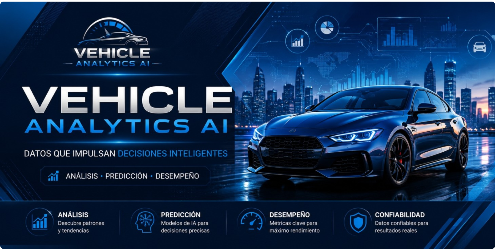
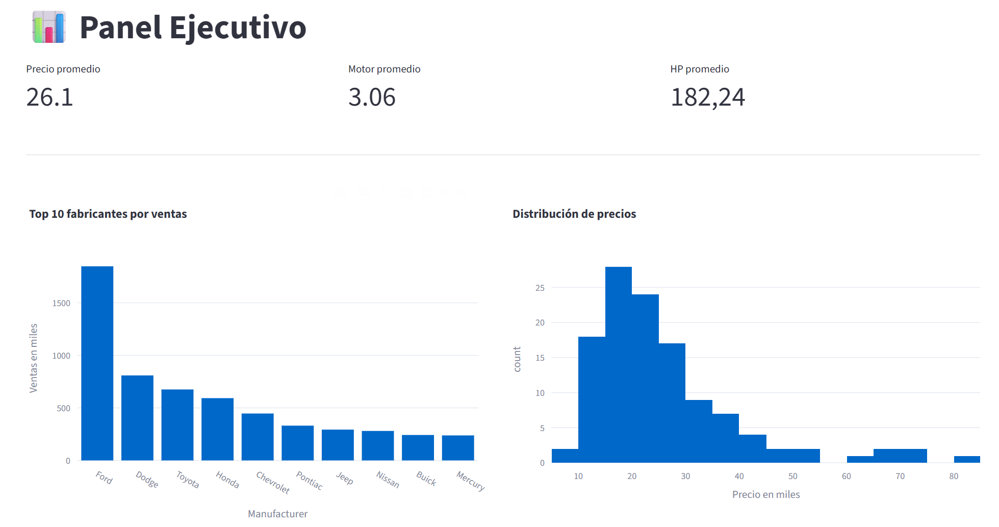
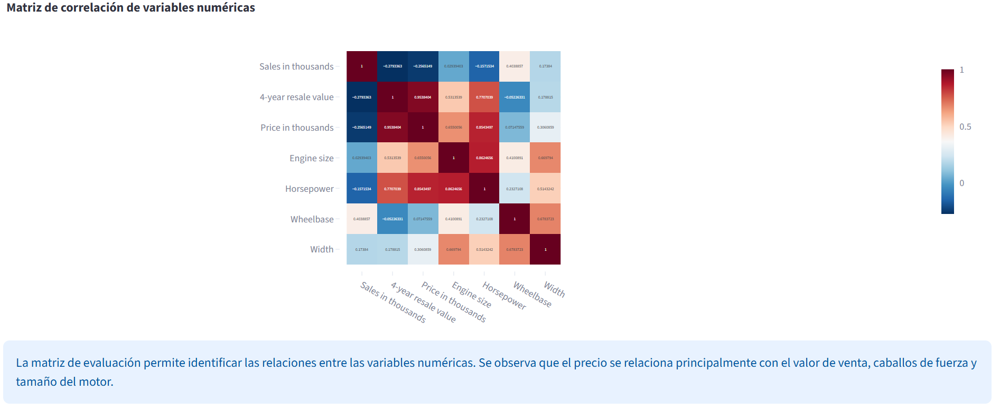
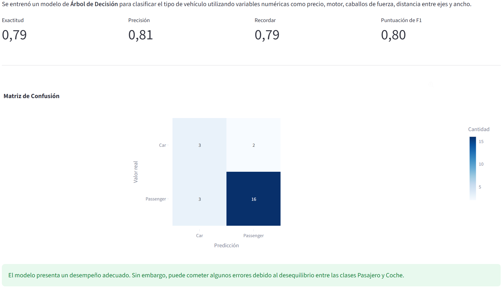
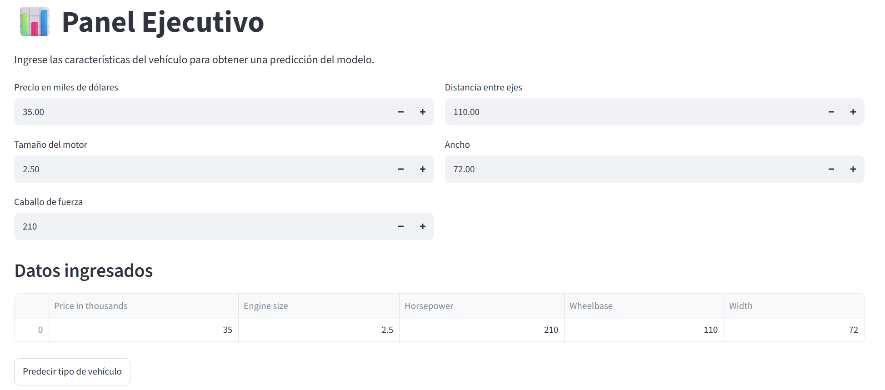

# 🚗 Vehicle Analytics AI

Dashboard interactivo para análisis, visualización y clasificación de vehículos utilizando Machine Learning y Streamlit.

---

## 🖼 Vista principal

---

## 📊 Dashboard Ejecutivo

---

## 🔥 Matriz de Correlación

---

## 🤖 Modelo Predictivo

---

## 🎯 Predicción de Vehículos

---

## 🛠 Tecnologías utilizadas

- Python
- Streamlit
- Pandas
- Plotly
- Scikit-learn
- Seaborn
- Matplotlib

---

## 👤 Autor

Carlos Alfredo González Hernández
Actualización README con capturas
